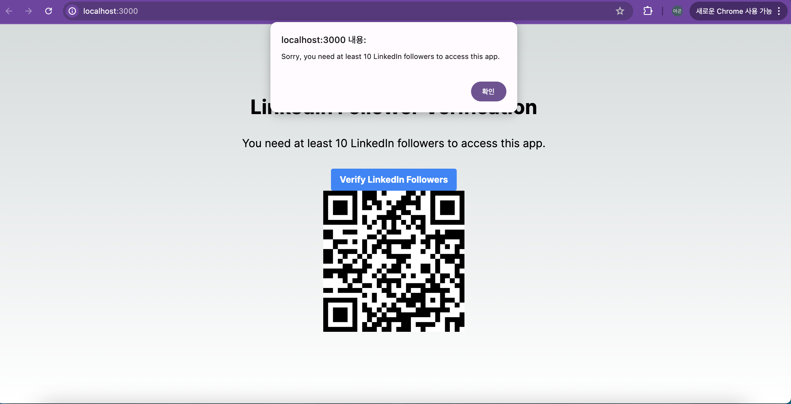

# 링크드인 인증 페이지 만들기

이 가이드에서는 리클레임 프로토콜을 사용하여 사용자의 링크드인 팔로워 수가 10명 이상이어야 접속 가능한 Next.js 애플리케이션을 만드는 과정을 설명한다. 서버 측에서 실행되어야 할 부분과 클라이언트 측에서 실행되는 부분을 구분하여 설명한다.

## 0. 완성 예시


* [깃헙 컨트리뷰선 검증](https://linkedin-verification.vercel.app/) 페이지는 링크드인 팔로워가 10명이면 접속 가능한 페이지를 제공한다
* 완성 프로젝트의 소스 코드는 [해당 리포지토리](https://github.com/humblefirm/linkedin_verification)를 참고한다.

## 1. 프로젝트 설정

먼저 새로운 Next.js 프로젝트를 생성한다:

```bash
npx create-next-app linkedin-follower-verification
cd linkedin-follower-verification
```
* next-app 폴더 생성 과정에서 프롬프트에 나오는 질문 중 typescript 사용 여부를 제외한 모두 yes를 선택해도 무관하다

QR 코드 페이지 생성을 위해 필요한 패키지를 설치한다:

```bash
npm install @reclaimprotocol/js-sdk react-qr-code
```

## 2. Reclaim Protocol 구현

`app/page.js` 파일을 다음과 같이 작성한다:

```jsx
"use client";
import { useState, useEffect } from "react";
import { useRouter } from "next/navigation";
import { Reclaim } from "@reclaimprotocol/js-sdk";
import QRCode from "react-qr-code";

const APP_ID = "YOUR_APP_ID";
const APP_SECRET = "YOUR_APP_SECRET";
const PROVIDER_ID = "4f041b5a-56b7-49e7-8289-e64cf5dad5a0"; // LinkedIn Equal ABD

export default function Home() {
  const [url, setUrl] = useState("");
  const [isMobile, setIsMobile] = useState(false);
  const [isVerifying, setIsVerifying] = useState(false);
  const router = useRouter();

  const reclaimClient = new Reclaim.ProofRequest(APP_ID);

  useEffect(() => {
    const isMobile = /iPhone|iPad|iPod|Android/i.test(navigator.userAgent);
    setIsMobile(isMobile);
  }, []);

  const handleVerificationSuccess = (proof) => {
    console.log("Verification success", proof);
    const followerCount = parseInt(
      JSON.parse(proof[0].claimData.parameters).paramValues.followers
    );
    if (followerCount >= 10) {
      router.push("/congrats");
    } else {
      alert(
        "Sorry, you need at least 10 LinkedIn followers to access this app."
      );
    }
    setIsVerifying(false);
  };

  const handleVerificationFailure = (error) => {
    console.error("Verification failed", error);
    alert("Verification failed. Please try again.");
    setIsVerifying(false);
  };

  const setupReclaimClient = async () => {
    await reclaimClient.buildProofRequest(PROVIDER_ID);
    reclaimClient.setSignature(
      await reclaimClient.generateSignature(APP_SECRET)
    );
  };

  const startReclaimSession = () => {
    reclaimClient.startSession({
      onSuccessCallback: handleVerificationSuccess,
      onFailureCallback: handleVerificationFailure,
    });
  };

  const getVerificationReq = async () => {
    setIsVerifying(true);
    await setupReclaimClient();
    const { requestUrl } = await reclaimClient.createVerificationRequest();
    startReclaimSession();
    window.open(requestUrl, "_blank");
  };

  const generateVerificationRequest = async () => {
    reclaimClient.addContext(
      `user's linkedin follower count`,
      "for Road To Global, ludium and namulabs"
    );
    await setupReclaimClient();
    const { requestUrl } = await reclaimClient.createVerificationRequest();
    setUrl(requestUrl);
    startReclaimSession();
  };

  const handleVerifyClick = () => {
    if (isMobile) {
      getVerificationReq();
    } else {
      generateVerificationRequest();
    }
  };

  return (
    <main className="flex flex-col items-center justify-center min-h-screen p-24">
      <h1 className="mb-8 text-4xl font-bold">
        LinkedIn Follower Verification
      </h1>
      <p className="mb-8 text-xl">
        You need at least 10 LinkedIn followers to access this app.
      </p>
      <button
        onClick={handleVerifyClick}
        disabled={isVerifying}
        className="px-4 py-2 font-bold text-white bg-blue-500 rounded hover:bg-blue-700"
      >
        {isVerifying ? "Verifying..." : "Verify LinkedIn Followers"}
      </button>
      {url && <QRCode value={url} />}
    </main>
  );
}
```

## 3. 구현 과정 설명

### Reclaim Client 초기화

```javascript
const reclaimClient = new Reclaim.ProofRequest(APP_ID);
```

Reclaim Protocol과 상호작용하기 위한 클라이언트를 초기화한다. `APP_ID`는 [Reclaim Protocol 개발자 대시 보드](https://dev.reclaimprotocol.org/applications)에 'New Application'을 등록하여 얻을 수 있다.


1. 개발자 대시보드에 접속한다
2. New Application을 클릭하여 새로운 어플리케이션 등록을 시작한다
3. 데이터 프로바이더를 선택한다. 해당 미션에서는 "LinkedIn Equal ABD"(ID: 4f041b5a-56b7-49e7-8289-e64cf5dad5a0)를 사용해서 등록을 완료한다


어플리케이션 등록이 완료되면 나의 어플리케이션 페이지에서 `APP_ID`, `APP_SECRET`, `PROVIDER_ID`을 확인할 수 있다.  `app/page.js`에서 나의 어플리케이션 정보를 등록한다.

```jsx
const APP_ID = "YOUR_APP_ID";
const APP_SECRET = "YOUR_APP_SECRET";
const PROVIDER_ID = "4f041b5a-56b7-49e7-8289-e64cf5dad5a0"; // LinkedIn Equal ABD
```

### 클라이언트 설정

```javascript
const setupReclaimClient = async () => {
  await reclaimClient.buildProofRequest(PROVIDER_ID);
  reclaimClient.setSignature(await reclaimClient.generateSignature(APP_SECRET));
};
```

이 부분은 보안상 서버 측에서 실행되어야 한다. `APP_SECRET`은 절대 클라이언트에 노출되어서는 안 된다.
그러나 이 예시에서는 편의를 위해 클라이언트에서 실행된다.

### 증명 요청 생성

```javascript
const generateVerificationRequest = async () => {
  reclaimClient.addContext(
    `user's linkedin follower count`,
    "for Road To Global, ludium and namulabs"
  );
  await setupReclaimClient();
  const { requestUrl } = await reclaimClient.createVerificationRequest();
  setUrl(requestUrl);
  startReclaimSession();
};
```

이 함수는 증명 요청을 생성하고 QR 코드에 사용될 URL을 설정한다.

### 세션 시작

```javascript
const startReclaimSession = () => {
  reclaimClient.startSession({
    onSuccessCallback: handleVerificationSuccess,
    onFailureCallback: handleVerificationFailure,
  });
};
```

Reclaim 세션을 시작하고 성공/실패 콜백을 설정한다.

### 결과 처리

```javascript
const handleVerificationSuccess = (proof) => {
  console.log("Verification success", proof);
  const followerCount = parseInt(
    JSON.parse(proof[0].claimData.parameters).paramValues.followers
  );
  // ... 결과에 따른 처리
};
```

증명 결과를 처리하고 필요한 액션을 수행한다.

## 4. 주의사항

1. `APP_SECRET`은 반드시 서버 측에서 관리한다. 이 예제에서는 학습을 위해 클라이언트 측에 포함되어 있지만, 실제 구현에서는 절대 이렇게 하면 안된다.

2. 증명 요청 생성과 서명 과정(`setupReclaimClient`)도 이상적으로는 서버 측에서 처리해야 한다.

3. 실제 구현에서는 증명 결과의 유효성을 서버 측에서 한 번 더 검증하는 것이 좋다.

## 5. 실행 및 테스트


1. `APP_ID`, `APP_SECRET`, `PROVIDER_ID`를 실제 값으로 교체한다
2. `npm install`로 설치한다
3. `npm run dev`로 애플리케이션을 실행한다
4. 브라우저에서 `http://localhost:3000`에 접속한다
5. "Verify LinkedIn Followers" 버튼을 클릭하고 프로세스를 따른다
